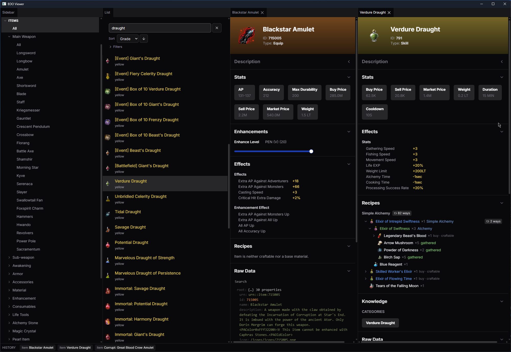
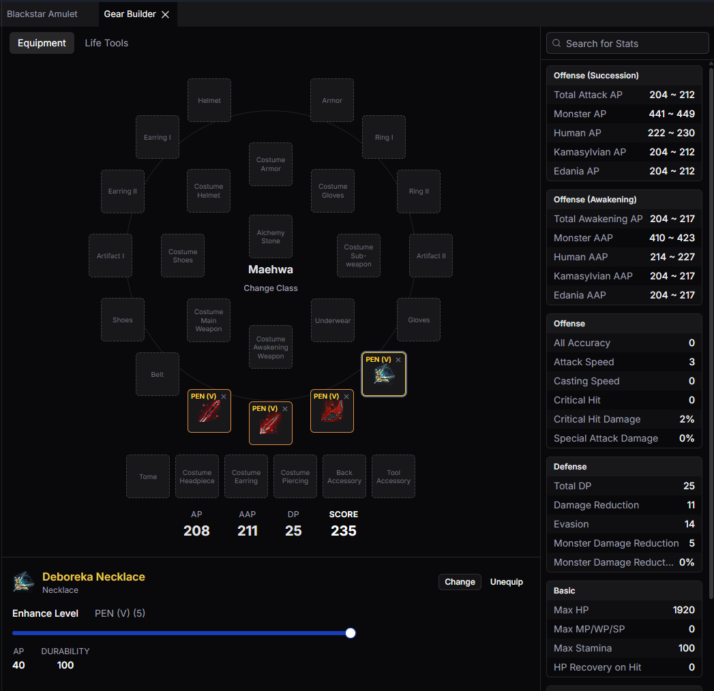
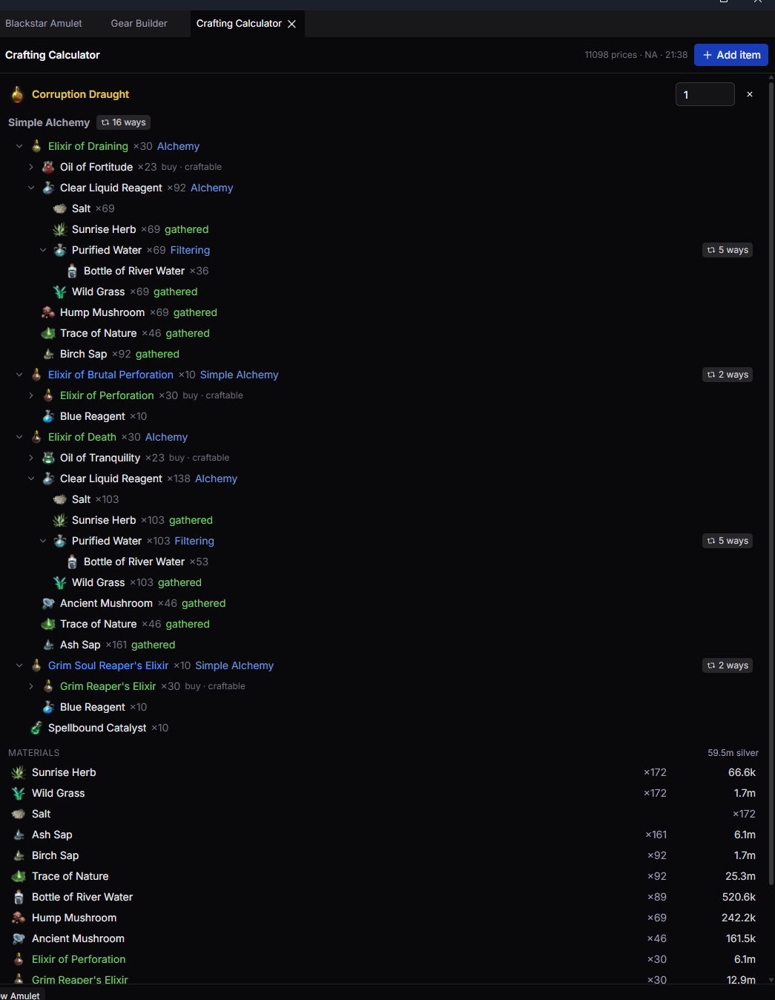

# bdo-viewer

A desktop companion app for **Black Desert Online** that browses the game's own
data — items with crafting trees, a **market-priced crafting calculator**, a
**gear builder**, knowledge/ecology, NPCs, and grind zones. It's the GUI front
end for [**bdo-data-extractor**](https://github.com/iDevelopThings/bdo-data-extractor):
it drives the extraction for you on first run, then renders everything locally.

Built with **Wails 3** (Go backend) and a **React + TypeScript** frontend
(Tailwind, dockable panels). Everything comes from **your own installed game
files** — no scraping, no third-party data sites. The one exception is live
Central Market prices (server-side, so genuinely not in the client), fetched as
an optional overlay for the calculator.

## Screenshots

### Item catalog/data


### Full gear builder


### Comprehensive crafting calculator


## Features

- **Item catalog** — every item with description, stats and enhancement curve,
  consumable effects, its full **recipe tree** + "used in", and acquisition
  (which vendors sell it, gather sources, and nodes).
- **Crafting Calculator** — build a list of items + quantities; it rolls each up
  as a tree and **combines them into one shopping list** of base materials, lets
  you switch between alternative recipes, and hints which base materials are
  vendor-bought (and where). Enter your **Cooking / Alchemy / Processing mastery**
  and it scales each craft's yield by the in-client mastery proc curves. With
  **market prices** loaded, each base material shows its live cost and the list
  totals an estimated craft cost.
- **Gear Builder** — equip a full set per class (weapons, armor, accessories,
  artifacts, lightstones, costumes) at chosen enhancement levels and see combined
  **AP / AAP / DP**, a gear score, and the full offense (succession + awakening,
  per target) / defense / basic stat breakdown.
- **Compare** — put two items side by side and diff their overview, gear stats at
  a shared enhancement level, and consumable effects.
- **Knowledge / Ecology** browser — the category tree → entries, linked to items
  and NPCs.
- **NPCs** (grouped by town) and **Grind Zones** (Monster Zone Info).
- **Dockable panels** — arrange and persist your own layout of the views above.

## How it works

On first launch the viewer opens a **setup wizard**: point it at your Black
Desert Online install, pick a language, and it runs the extraction (via the
bundled `bdo-data-extractor` pipeline) into a per-user data directory. There's no
separate extractor step — the viewer does it for you.

Everything the viewer stores lives under the OS cache directory:

- **Windows:** `%LocalAppData%\bdo-viewer\` — `config.json` (settings) plus the
  extracted dataset (`items.json`, `recipes.json`, icons, …).

The dataset is large but fully regenerable — re-run extraction from **Settings**
after a game patch to refresh it.

## Requirements

- **Go 1.26+** and **Node.js 18+** (npm), to build the Go backend and the React
  frontend.
- The **Wails 3 CLI** — see the [Wails v3 docs](https://v3.wails.io/) for install
  and platform prerequisites. On Windows the app runs on **WebView2** (bundled
  with Windows 10/11).
- A **legally installed copy of Black Desert Online** — the viewer only *reads*
  files from your own install to build its dataset (see [Disclaimer](#disclaimer)).
  **Windows** is the supported target (it's where BDO runs); other platforms build
  from source.

## Build & run

```sh
# development (hot-reload for both Go and the frontend)
wails3 dev

# production build -> the build output directory
wails3 build
```

The frontend can be worked on independently from `frontend/` (`npm run dev`),
but `wails3 dev` runs the whole app.

## Updating

Release builds update themselves in place via Wails v3's native updater, pulling
new versions from the project's GitHub releases. You can also just rebuild from
source.

## Relationship to bdo-data-extractor

The viewer imports [bdo-data-extractor](https://github.com/iDevelopThings/bdo-data-extractor)
as a Go module for the extraction pipeline and the shared output types, so the
JSON the CLI produces and the data the viewer reads are the same schema. If you
only want the raw JSON/icons (no GUI), use the extractor directly.

## Disclaimer

> This is an **independent, unofficial** tool. It is **not affiliated with,
> endorsed by, or connected to Pearl Abyss Corp.** "Black Desert Online" and all
> related names and marks are trademarks of Pearl Abyss, used here only to
> identify the game these files belong to.
>
> **No game code, assets, or data are included or redistributed** in this
> repository. bdo-viewer only *reads* files from a copy of Black Desert Online
> that **you have legally installed on your own machine** — you must own and
> install the game yourself. Extraction is strictly **read-only** on the game
> directory, and nothing from it is redistributed.
>
> Central Market prices are fetched from a public third-party API as an optional,
> in-memory overlay; they're never bundled or written to disk, and the extracted
> reference data stays 100% client-sourced.
>
> Provided for personal, educational, and non-commercial use (see
> [LICENSE](LICENSE.md)). Respect the game's Terms of Service. Use at your own
> risk; no warranty.
>
> If you are Pearl Abyss and would like something changed or removed, please open
> an issue and it will be addressed.
